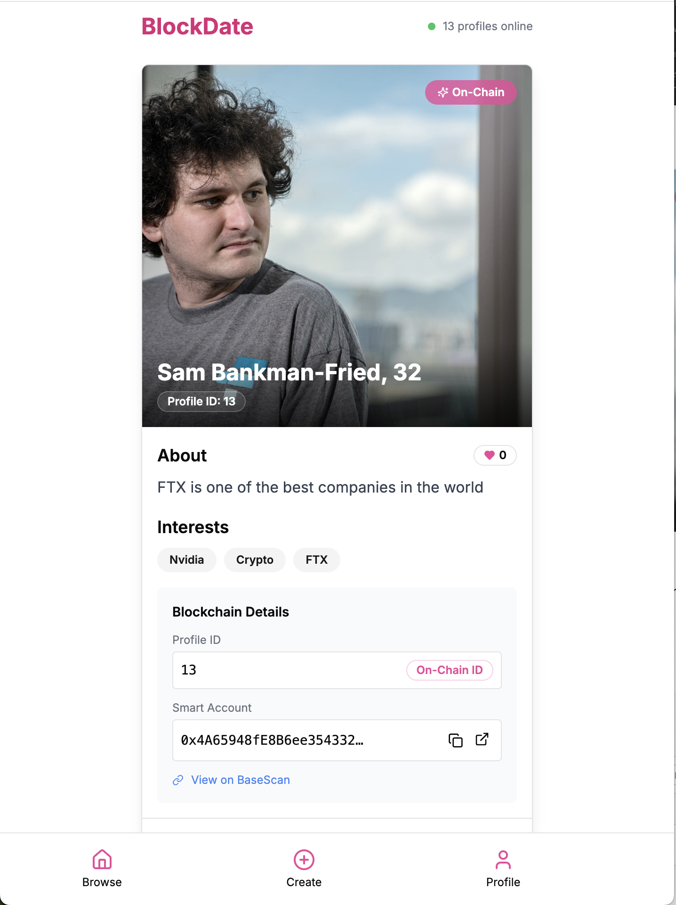
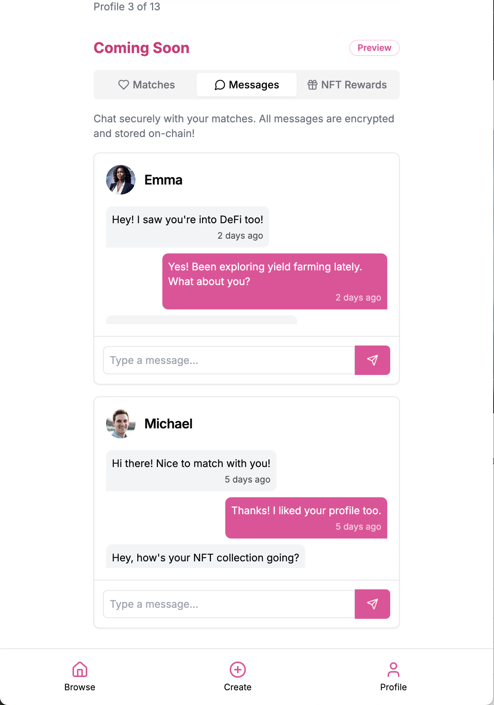

# BlockDate: On-Chain Dating Web App 💘

[](https://blockdatedefi.vercel.app/browse)
[]()
[]()
[]()

## 🔗 [Live Demo: BlockDate](https://blockdatedefi.vercel.app/browse)

BlockDate is a decentralized dating application built on the Base Sepolia blockchain. The platform allows users to create profiles, browse potential matches, and express interest through on-chain "likes" using Coinbase CDP Smart Accounts.





## 📋 Features

- **Decentralized Profile Creation**: Store your dating profile securely on the blockchain
- **Immutable Dating History**: All likes and interactions are permanently recorded on-chain
- **Gasless Transactions**: Uses Coinbase CDP Smart Accounts for a seamless user experience
- **Tinder-style Interface**: Familiar card swiping UX for browsing potential matches
- **Web3 Privacy**: Control your own data with blockchain technology

## 🧰 Tech Stack

- **Frontend**: React, Next.js, Tailwind CSS
- **Blockchain**: Coinbase CDP SDK, viem, @coinbase/wallet-sdk
- **Smart Contract**: Deployed on Base Sepolia at [0x1b14db9335e9f6ef02877e685472aaa459b544db](https://sepolia-explorer.base.org/address/0x1b14db9335e9f6ef02877e685472aaa459b544db)
- **Environment**: dotenv for secure credential management

## 🚀 Getting Started

### Prerequisites

- Node.js v22.0.0
- Coinbase CDP API Keys ([Get your keys here](https://docs.cdp.coinbase.com/wallet-api-v2/docs/welcome))
- Base Sepolia test ETH

### Installation

1. Clone the repository:
   ```bash
   git clone https://github.com/yourusername/blockdate.git
   cd blockdate
   ```

2. Set up environment variables:
   Create a `.env.local` file with the following:
   ```
   CDP_API_KEY_ID=your-api-key-id
   CDP_API_KEY_SECRET=your-api-key-secret
   CDP_WALLET_SECRET=your-wallet-secret
   ```

3. Install dependencies:
   ```bash
   nvm use 22.0.0
   npm install --legacy-peer-deps
   ```

4. Run the development server:
   ```bash
   npm run dev
   ```

5. Open [http://localhost:3000](http://localhost:3000) in your browser

## 🛠️ Smart Contract Integration

The application integrates with a deployed smart contract on Base Sepolia that handles profile creation, profile retrieval, and "liking" functionality.

### Contract Address
```
0x1b14db9335e9f6ef02877e685472aaa459b544db
```

### Key Contract Functions

```solidity
// Create a new dating profile
function createProfile(string name, uint age, string bio, string interests, string imageUrl)

// Like another user's profile (on-chain interaction)
function likeProfile(uint profileId)

// Retrieve profile data
function getProfile(uint profileId)

// Get total number of profiles
function profileCount() view returns (uint)
```

## 📱 Application Flow

1. **Account Creation**: CDP Smart Accounts are automatically created for new users
2. **Profile Setup**: Users create their dating profile (stored on-chain)
3. **Browse Profiles**: Swipe through potential matches
4. **Like Profiles**: Express interest with on-chain "likes"
5. **View Statistics**: See how many likes you've received


## 💻 CDP Wallet Integration

This application uses [Coinbase Developer Platform (CDP)](https://docs.cdp.coinbase.com/wallet-api-v2/docs/welcome) for handling blockchain interactions. CDP provides:

- **Smart Accounts**: Account abstraction for gasless transactions
- **Simple API**: Straightforward blockchain interaction without complex wallet management
- **Security**: Enterprise-grade security for managing crypto assets

### CDP Client Initialization

```javascript
import { CdpClient } from "@coinbase/cdp-sdk";

const cdp = new CdpClient({
  apiKeyId: process.env.CDP_API_KEY_ID,
  apiKeySecret: process.env.CDP_API_KEY_SECRET,
  walletSecret: process.env.CDP_WALLET_SECRET,
});
```

### Creating Smart Accounts

```javascript
const { smartAccounts } = await cdp.accounts.createAccounts({
  chain: "base-sepolia",
  count: 1,
});
```

### Sending User Operations

```javascript
const txHash = await cdp.transactions.sendUserOperation({
  chainId: baseSepolia.id,
  account: smartAccount.address,
  encodedFunctionData: encodedData,
});
```

For more details on the CDP SDK, refer to the [official documentation](https://docs.cdp.coinbase.com/wallet-api-v2/docs/welcome).


## ⚠️ Common Issues & Solutions

### Missing Environment Variables

If you see the following error:
```
Missing required CDP Secret API Key configuration parameters.
```

Ensure your `.env.local` file contains all three required variables:
```
CDP_API_KEY_ID=your-api-key-id
CDP_API_KEY_SECRET=your-api-key-secret
CDP_WALLET_SECRET=your-wallet-secret
```

### Transaction Errors

If transactions are failing, check the following:
1. Your CDP keys are valid and have sufficient permissions
2. The smart account has Base Sepolia test ETH (visit a faucet if needed)
3. The contract address is correct in your configuration

## 🤝 Contributing

Contributions are welcome! Please feel free to submit a Pull Request.

## 📄 License

This project is licensed under the MIT License - see the LICENSE file for details.

## 🙏 Acknowledgements

- Built with [Coinbase Developer Platform](https://docs.cdp.coinbase.com/wallet-api-v2/docs/welcome)
- Smart contract deployed on [Base Sepolia](https://sepolia-explorer.base.org/)
- Inspired by traditional dating apps, reimagined for Web3